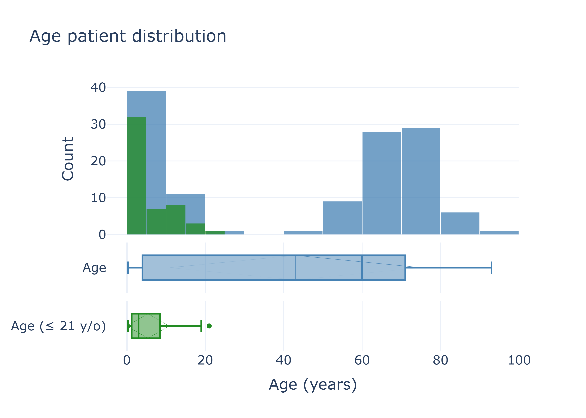
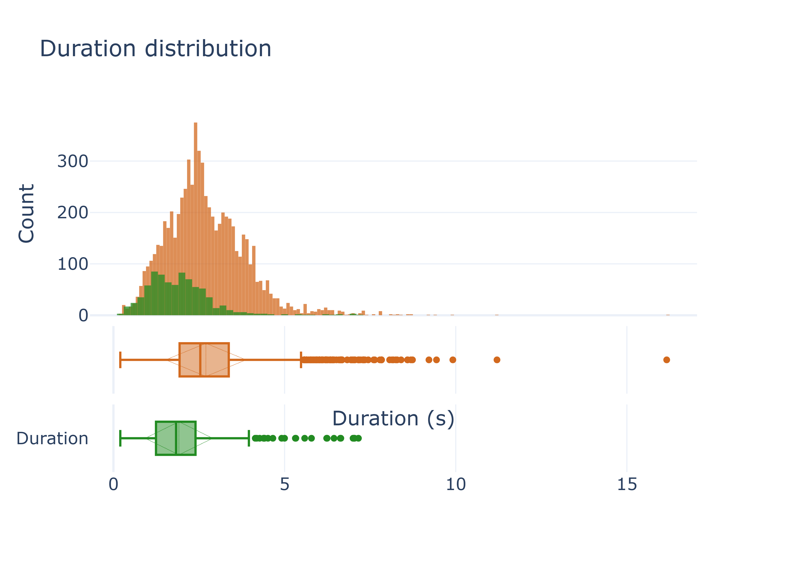
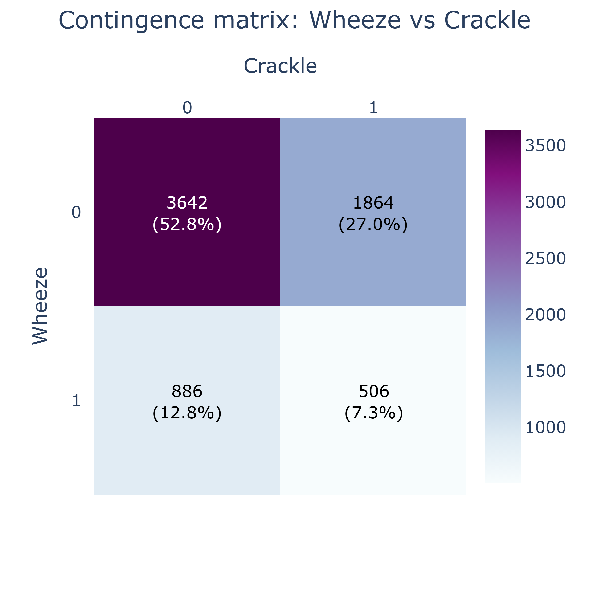
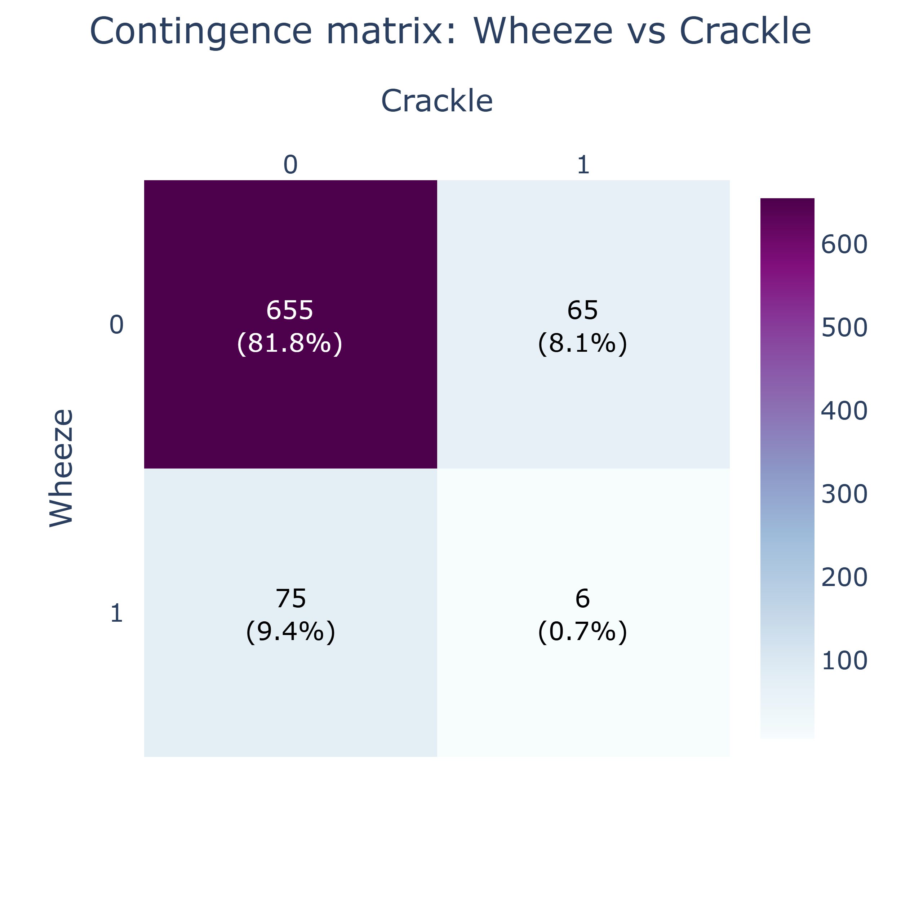

# 🌬️ ICBHI — Respiratory Cycle Duration Study

This folder is **not** a data-preparation pipeline for the classification pipeline — it does not feed into `classification/`. It exists to answer a question raised while building the [📊 Dataset pipeline](../dataset/README.md) on [SPRSound](https://github.com/SJTU-YONGFU-RESEARCH-GRP/SPRSound): SPRSound's fragments are annotated **per acoustic event** (a wheeze, a crackle, …), not per respiratory cycle, so there is no direct way to know how long a full inspiration/expiration cycle typically lasts in a pediatric population.

The **[ICBHI 2017 Challenge](https://bhichallenge.med.auth.gr/ICBHI_2017_Challenge)** database, in contrast, segments every recording into individual **respiratory cycles**. This folder runs a small subset of the [📊 Dataset pipeline](../dataset/README.md) steps over ICBHI 2017, restricted to patients **≤ 21 years old**, purely to characterize how respiratory-cycle durations are distributed in a pediatric population, as a sanity check for whether SPRSound's fragments should be filtered by duration before being used for training.

> **Result:** the duration distributions of both datasets turned out to be comparable (see [📝 EDA results](#-eda-results)), so no duration-based filtering was applied to SPRSound.

---

## Table of Contents

- [📂 Repository layout](#-repository-layout)
- [⚙️ Quickstart](#️-quickstart)
- [🔁 Pipeline overview](#-pipeline-overview)
    - [1️⃣ Extract the raw ICBHI records — get_icbhi_dataset.py](#1️⃣-extract-the-raw-icbhi-records--get_icbhi_datasetpy)
    - [2️⃣ Build the metadata table — get_metadata.py](#2️⃣-build-the-metadata-table--get_metadatapy)
    - [3️⃣ Extract respiratory-cycle fragments — get_fragments.py](#3️⃣-extract-respiratory-cycle-fragments--get_fragmentspy)
    - [➕ Extra: check for multichannel recordings — check_channels.py](#-extra-check-for-multichannel-recordings--check_channelspy)
- [📁 Final folder layout](#-final-folder-layout)
- [📓 Notebooks](#-notebooks)
    - [▶️ How to run](#️-how-to-run)
    - [visualization_signal.ipynb — Raw record + preprocessing](#visualizationsignalipynb--raw-record--preprocessing)
    - [EDA.ipynb — Exploratory Data Analysis](#edaipynb--exploratory-data-analysis)
        - [📝 EDA results](#-eda-results)

---

## 📂 Repository layout

When you clone the repository, `ICBHI/` ships with the pipeline scripts and the two exploratory notebooks — but no data. After running the full pipeline, see [📁 Final folder layout](#-final-folder-layout) for what ends up in this directory.

```
ICBHI/
├── assets/                   ← folder with the images in this file
├── README.md                 ← this file
├── get_icbhi_dataset.py      ← step 1
├── get_metadata.py           ← step 2
├── get_fragments.py          ← step 3
├── check_channels.py         ← extra utility
├── EDA.ipynb                 ← exploratory analysis of the duration distributions
└── visualization_signal.ipynb ← raw record + preprocessing visualization
```

---

## ⚙️ Quickstart

From the project root:

```bash
# 0. Download the ICBHI 2017 Challenge dataset (one-time, manual)
#    https://bhichallenge.med.auth.gr/ICBHI_2017_Challenge
#    Move every file into ICBHI/ICBHI/data/ and remove the non-data files
#    (filename_differences.txt, filename_format.txt, ...)

# 1-3. Run the pipeline in order
python ICBHI/get_icbhi_dataset.py
python ICBHI/get_metadata.py
python ICBHI/get_fragments.py

# Optional QC: list recordings with more than one channel
python ICBHI/check_channels.py
```

The resulting `ICBHI/fragments_metadata.csv` (one row per respiratory cycle) is what `EDA.ipynb` reads to compare cycle-duration distributions against SPRSound's fragments.

---

## 🔁 Pipeline overview

| Step | Script | Input | Output |
|:----:|:-------|:------|:-------|
| **1/3** | `get_icbhi_dataset.py` | `ICBHI/ICBHI/data/` (raw download) | `ICBHI/ICBHI/data/wav/`, `ICBHI/ICBHI/data/json/` |
| **2/3** | `get_metadata.py` | `ICBHI/ICBHI/data/wav/`, `ICBHI/ICBHI/data/json/` | `metadata.csv` |
| **3/3** | `get_fragments.py` | `ICBHI/ICBHI/data/wav/`, `ICBHI/ICBHI/data/json/` | `dataset/audio/`, `fragments_metadata.csv` |

Unlike the [📊 Dataset pipeline](../dataset/README.md), there is no quality-filtering step and no time–frequency representation (RTF) step — this subfolder only goes as far as needed to obtain per-cycle durations.

---

### 1️⃣ Extract the raw ICBHI records — [get_icbhi_dataset.py](get_icbhi_dataset.py)

Collects every `.wav` recording from the raw ICBHI download and converts its companion `.txt` cycle-annotation file (tab-separated `start`, `end`, `Crackle`, `Wheeze` columns, one row per respiratory cycle) into a `.json` file with the same content.

**Requires:** a manual download of the ICBHI 2017 Challenge dataset, with every file placed directly under `ICBHI/ICBHI/data/` (non-data files such as `filename_differences.txt`, `filename_format.txt`, … removed).

**Generates:**
```
ICBHI/ICBHI/data/
├── wav/   # {patient_id}_{record_id}_{position}_{acquisition}_{equipment}.wav
└── json/  # {patient_id}_{record_id}_{position}_{acquisition}_{equipment}.json
```

**Run:**
```bash
python ICBHI/get_icbhi_dataset.py
```

---

### 2️⃣ Build the metadata table — [get_metadata.py](get_metadata.py)

Parses the ICBHI filename convention (`{patient_id}_{record_id}_{position}_{acquisition}_{equipment}`) and reads each `.wav`'s duration to produce a single `metadata.csv` describing every record.

**Per-record fields:**

| Field | Description |
|:------|:------------|
| `id` | Sequential record id |
| `patient_id` | ICBHI patient id |
| `record_id` | ICBHI recording index for that patient |
| `position` | Recording position code (e.g. `Tc` = trachea, `Al`/`Ar` = anterior left/right, `Pl`/`Pr` = posterior left/right, `Ll`/`Lr` = lateral left/right) |
| `acquisition` | `sc` = single channel, `mc` = multichannel |
| `equipment` | Recording device (`Meditron`, `LittC2SE`, `Litt3200`, `AKGC417L`, …) |
| `json_path` | Relative path to the `.json` annotation |
| `wav_path` | Relative path to the `.wav` file |
| `duration` | Recording duration, in seconds |

**Run:**
```bash
python ICBHI/get_metadata.py
```

**Generates:** `ICBHI/metadata.csv`

---

### ➕ Extra: check for multichannel recordings — [check_channels.py](check_channels.py)

Standalone QC utility, independent of the numbered pipeline. Iterates over `ICBHI/ICBHI/data/wav/` and reports every `.wav` file with more than one audio channel. It found **zero** multichannel recordings in this dataset, so [step 3](#3️⃣-extract-respiratory-cycle-fragments--get_fragmentspy) does not implement any multichannel-specific handling.

**Requires:** `ICBHI/ICBHI/data/wav/` (i.e. step 1 already run)

**Run:**
```bash
python ICBHI/check_channels.py
```

---

### 3️⃣ Extract respiratory-cycle fragments — [get_fragments.py](get_fragments.py)

For every record, crops the signal at each annotated respiratory cycle's `[start, end]` timestamps (converted to sample indices using that record's own **native sample rate**, which varies by equipment — 4 kHz, 10 kHz or 44.1 kHz have all been observed in this dataset) and writes it out as a sequential `{id}.wav` at that same native rate, alongside a `fragments_metadata.csv` with per-cycle labels. Unlike the [📊 Dataset pipeline](../dataset/README.md#4️⃣-extract-annotated-respiratory-fragments--get_fragmentspy), no bandpass filtering or resampling is applied — this step only needs correctly-cropped cycles to measure their duration, not model-ready audio.
>
> No multichannel handling is needed: the [check_channels.py](#-extra-check-for-multichannel-recordings--check_channelspy) QC step found zero multichannel recordings in this dataset.

**Per-fragment fields:**

| Field | Description |
|:------|:------------|
| `id` | Sequential fragment id (matches the `.wav` filename) |
| `patient_id` | ICBHI patient id |
| `id_record` | Source record id (matches `metadata.csv`'s `id`) |
| `segment` | Index of this respiratory cycle within its record (0-based) |
| `Crackle` | `1` if the cycle contains a crackle, else `0` |
| `Wheeze` | `1` if the cycle contains a wheeze, else `0` |
| `duration` | Cycle duration, in seconds |

**Generates:**
```
ICBHI/dataset/
└── audio/                  # {id}.wav
ICBHI/fragments_metadata.csv
```

**Run:**
```bash
python ICBHI/get_fragments.py
```

---

## 📁 Final folder layout

After running the full pipeline, the relevant outputs are (compare with [📂 Repository layout](#-repository-layout) to see what ships with the repo vs. what the pipeline produces):

```
ICBHI/
├── ICBHI/                 ← raw download (not shipped, git-ignored)
│   ├── data/              ← step 1
│   │   ├── wav/
│   │   └── json/
│   ├── ICBHI_Challenge_demographic_information.txt
│   └── ICBHI_Challenge_diagnosis.txt
├── dataset/                ← step 3
│   └── audio/             # per-cycle fragments
├── metadata.csv            ← step 2
└── fragments_metadata.csv  ← step 3
```

---

## 📓 Notebooks

The folder ships with two exploratory notebooks alongside the pipeline scripts (see [📂 Repository layout](#-repository-layout)). They are **read-only documentation and exploration** — running them does not modify the pipeline outputs.

### ▶️ How to run

From the `ICBHI/` folder, launch Jupyter / VS Code and open the notebook of interest, then run all cells in order.

### [visualization_signal.ipynb](visualization_signal.ipynb) — Raw record + preprocessing

Visualizes one full record end-to-end: loads a `.wav` and its companion `.json` from `ICBHI/data/`, applies the same bandpass (70–1900 Hz) + resampling (→ 4 kHz) preprocessing used in the [📊 Dataset pipeline](../dataset/README.md#4️⃣-extract-annotated-respiratory-fragments--get_fragmentspy), plus a 50 Hz comb filter for mains-hum removal, and plots the time-domain signal (with cycle annotations) and the PSD before vs. after preprocessing.

### [EDA.ipynb](EDA.ipynb) — Exploratory Data Analysis

Exploratory analysis of `metadata.csv` and `fragments_metadata.csv`, cross-referenced with `ICBHI/ICBHI_Challenge_demographic_information.txt` for patient age. The notebook:
- reports dataset-wide totals (records, segments, patients, recorded/corpus duration);
- filters patients down to **age ≤ 21** and reports the same totals for the filtered subset;
- flags the handful of respiratory cycles with a duration below 0.3 s;
- plots the age distribution (full population vs. the ≤ 21 filter) as an overlaid histogram + boxplot;
- plots the respiratory-cycle **duration** distribution (full population vs. the ≤ 21 filter) as an overlaid histogram + boxplot, to compare against SPRSound's [fragment duration distribution](../dataset/README.md#-results).

#### 📝 EDA results

- **Descriptive parameters:**
    - **Full dataset:**
        - Number of records: 920
        - Number of segments (respiratory cycles): 6898
        - Number of patients: 126
        - Total recorded time: 5 h 29 min 33.03 s
        - Corpus duration: 5 h 10 min 29.91 s (94.22%)

    - **Filtered to patients ≤ 21 years old:**
        - Number of records: 78 (8.48%)
        - Number of segments: 801 (11.61%)
        - Number of patients: 51 (40.48%)
        - Total recorded time: 25 min 59.19 s (7.89%)
        - Corpus duration: 25 min 32.1 s (8.22%)

- **Age distribution:**


| Metric | Age (years) | Age (≤ 21 y/o) (years) |
|:------:|:-----------:|:----------------------:|
|  Mean  |     42,99   |          5.39          |
|   std  |     32.08   |          5.39          |
|   min  |     0.25    |          0.25          |
|   Q1   |     4       |          1.25          |
| Median |     60      |          3             |
|   Q3   |     71      |          8.5           |
|   max  |      93     |          21            |

- **Fragment duration:**



| Metric | Duration (s) | Duration (≤ 21 y/o) (s) |
|:------:|:------------:|:-----------------------:|
|  Mean  |     2.70     |         1.91            |
|   std  |     1.17     |         0.99            |
|   min  |     0.20     |         0.20            |
|   Q1   |     1.93     |         1.24            |
| Median |     2.54     |         1.83            |
|   Q3   |     3.37     |         2.40            |
|   max  |     16.16    |         7.16            |

- **Label distribution:**
    - Global
    

    - Filtered (≤ 21 y/o)
    